# DoseCare

O DoseCare é um aplicativo mobile para organizar medicamentos e cuidados recorrentes de pessoas, animais e plantas. Ele foi pensado para quem cuida de uma ou várias vidas e precisa entender rapidamente o que demanda atenção, o que vem depois e o que já foi realizado.

A proposta do produto é oferecer uma experiência simples, acolhedora e confiável. O DoseCare ajuda a cuidar, mas não fiscaliza. Por isso, a interface evita linguagem culpabilizante, alertas exagerados e mecanismos de pressão.

> Tudo que você cuida, em um só lugar, no tempo certo.

## Instalação

Baixe o APK da versão mais recente na página de [releases](https://github.com/osamucadev/dose-care/releases) e abra o arquivo no celular Android. Talvez seja preciso permitir a instalação de apps de fontes externas.

O histórico de versões está no [CHANGELOG](./CHANGELOG.md).

## Funcionalidades atuais

### Perfis

- Vários perfis, de crianças, adultos, idosos, pets e plantas.
- Avatar ilustrado por perfil, com 31 opções e cinco tons de pele para pessoas (veja [Avatares](#avatares)).
- Edição de perfis.
- Exclusão sem perda de dados: o perfil sai da Home, mas o histórico continua guardado.

### Medicamentos de rotina

- Um ou mais horários fixos por dia, a partir de uma data de início.
- Tratamento contínuo, até uma data ou por quantidade de doses programadas.
- Desativar e reativar sem apagar o histórico.
- Opção, desligada por padrão, de permitir tomar a dose antes do horário, no mesmo dia.
- Editar uma rotina muda só as próximas doses, nunca o que já foi registrado.

### Doses

- **Agora:** a dose que precisa de atenção.
- **Próximo:** a próxima dose, inclusive quando cai no dia seguinte.
- Registro como Tomado ou Pulado em um toque, com proteção contra registro duplicado.
- "Desfazer" por alguns segundos depois de Tomado ou Pular. Fechar o app nesse intervalo não perde a ação.
- "Tomar agora" na próxima dose do dia, quando o medicamento permite antecipar.
- A tela se atualiza sozinha na virada de cada minuto, ao voltar do segundo plano e na troca de dia.

### Home

- Visão de todos os perfis, com o status de cada um.
- Filtro por perfil.
- Lista dos próximos cuidados.
- Seção "Para repor" com os medicamentos de estoque baixo.

### Histórico

- Histórico por perfil, com horário previsto e horário realizado.
- Doses tomadas antes da hora aparecem como "Tomado antes do horário".
- Um medicamento renomeado aparece com o nome atual e "Registrado como ..." com o nome da época. A dose mostrada é sempre a registrada.

### Lembretes

- Notificação no horário de cada dose, mesmo com o app fechado, sem internet nem servidor.
- Tocar na notificação abre o perfil da dose.
- Aviso para abrir o app três, dois e um dia antes de os lembretes programados acabarem.
- A permissão é pedida ao cadastrar o primeiro medicamento.

### Estoque

- Estoque contado em doses, por medicamento: cada dose tomada desconta uma, e dose pulada não desconta.
- Estimativa de quantos dias o estoque cobre.
- Aviso quando restam 10% ou menos da última contagem: selo no medicamento, seção na Home e notificação diária às 09:00 até a reposição.

### Visual e acessibilidade

- Modo claro e escuro.
- Contraste WCAG AA em todos os textos.
- Áreas de toque de pelo menos 48px.
- Status sempre com texto ou símbolo, nunca só por cor.
- Rótulos para leitores de tela, inclusive nos avatares e nos tons de pele.

### Dados

- Tudo fica no próprio aparelho, em SQLite, e o app funciona sem internet.
- Não há conta nem login.

## Telas

Capturas feitas com dados fictícios.

<table>
  <tr>
    <td align="center" width="33%">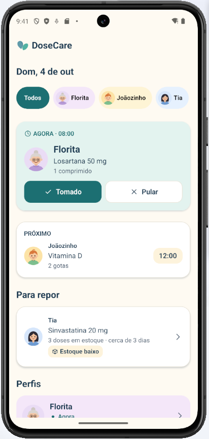<br><sub><b>Home:</b> o que precisa de atenção agora, o próximo cuidado e o que repor</sub></td>
    <td align="center" width="33%">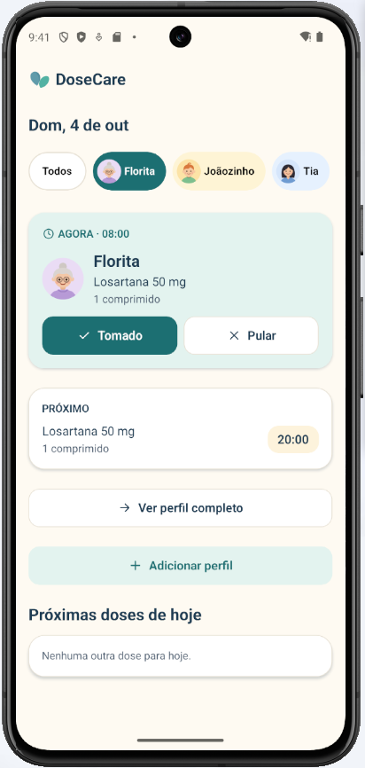<br><sub><b>Filtro por perfil:</b> só os cuidados da Florita</sub></td>
    <td align="center" width="33%">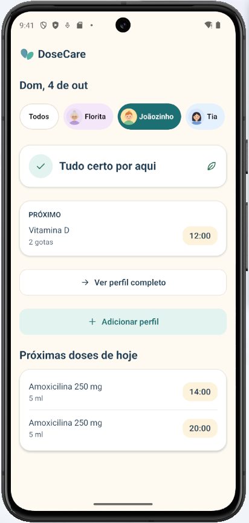<br><sub><b>Próximas doses de hoje</b> do Joãozinho</sub></td>
  </tr>
  <tr>
    <td align="center">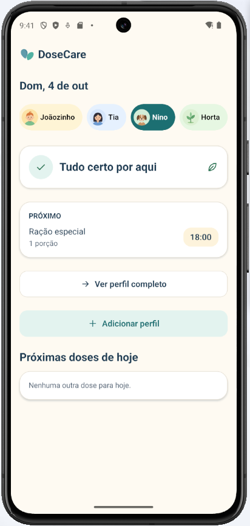<br><sub><b>Pets</b> também têm rotina</sub></td>
    <td align="center">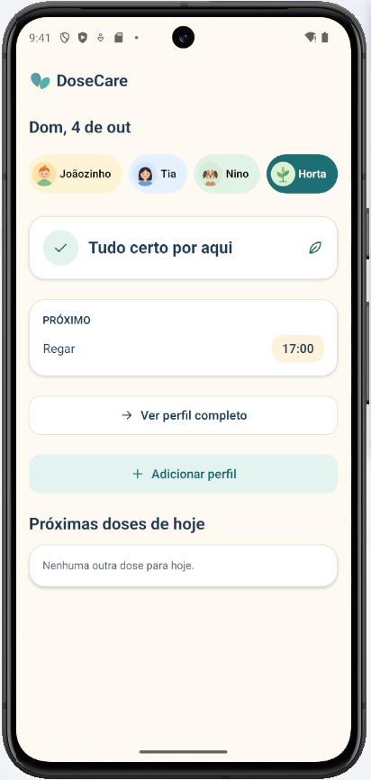<br><sub><b>Plantas:</b> rega como cuidado recorrente</sub></td>
    <td align="center">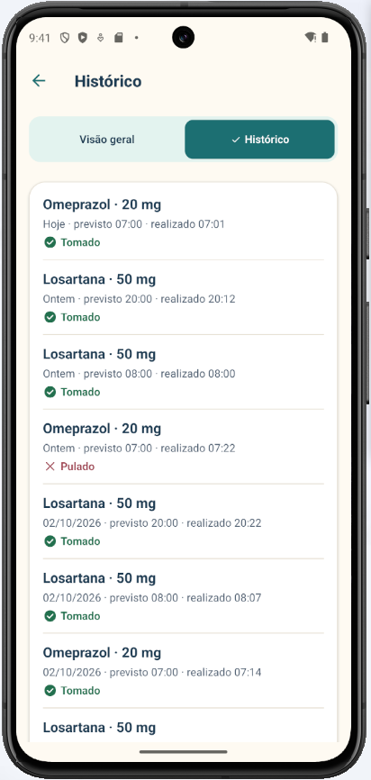<br><sub><b>Histórico:</b> horário previsto e realizado, tomado ou pulado</sub></td>
  </tr>
  <tr>
    <td align="center">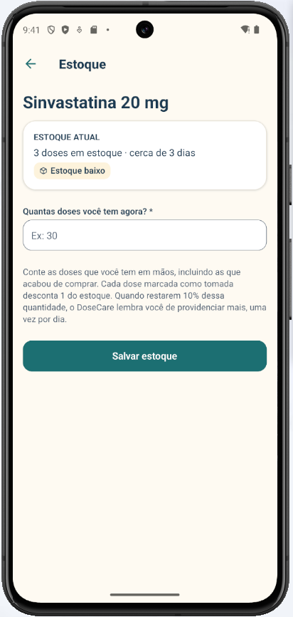<br><sub><b>Estoque:</b> doses restantes e aviso de reposição</sub></td>
    <td></td>
    <td></td>
  </tr>
</table>

## Avatares

Cada perfil tem um avatar ilustrado, escolhido entre as opções do seu tipo. São todos desenhos em SVG, sem emojis.

### Pessoas

Criança, adulto e idoso. O tom de pele é escolhido à parte, entre cinco opções, e vale para todos os avatares de pessoa daquele perfil. Perfil novo começa no tom médio.

<table>
  <tr>
    <td align="center"><br><sub>Menino</sub></td>
    <td align="center"><br><sub>Menina</sub></td>
    <td align="center"><br><sub>Bebê</sub></td>
    <td align="center"><br><sub>Mulher</sub></td>
    <td align="center"><br><sub>Homem</sub></td>
    <td align="center"><br><sub>Senhora</sub></td>
    <td align="center"><br><sub>Senhor</sub></td>
  </tr>
</table>

Os cinco tons, no avatar de mulher:

<table>
  <tr>
    <td align="center"><br><sub>Claro</sub></td>
    <td align="center"><br><sub>Médio claro</sub></td>
    <td align="center"><br><sub>Médio</sub></td>
    <td align="center"><br><sub>Médio escuro</sub></td>
    <td align="center"><br><sub>Escuro</sub></td>
  </tr>
</table>

### Pets

<table>
  <tr>
    <td align="center"><br><sub>Cachorro</sub></td>
    <td align="center"><br><sub>Labrador</sub></td>
    <td align="center"><br><sub>Husky</sub></td>
    <td align="center"><br><sub>Boxer</sub></td>
    <td align="center"><br><sub>Vira-lata caramelo</sub></td>
    <td align="center"><br><sub>Gato laranja</sub></td>
  </tr>
  <tr>
    <td align="center">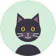<br><sub>Gato preto</sub></td>
    <td align="center"><br><sub>Gato branco</sub></td>
    <td align="center">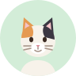<br><sub>Gato tricolor</sub></td>
    <td align="center">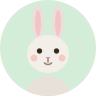<br><sub>Coelho</sub></td>
    <td align="center"><br><sub>Pássaro</sub></td>
    <td align="center">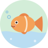<br><sub>Peixe</sub></td>
  </tr>
  <tr>
    <td align="center">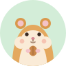<br><sub>Hamster</sub></td>
    <td align="center">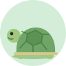<br><sub>Tartaruga</sub></td>
    <td align="center"><br><sub>Lagarto</sub></td>
    <td align="center"><br><sub>Cobra</sub></td>
    <td align="center"><br><sub>Robô</sub></td>
  </tr>
</table>

### Plantas

<table>
  <tr>
    <td align="center"><br><sub>Muda</sub></td>
    <td align="center"><br><sub>Planta no vaso</sub></td>
    <td align="center"><br><sub>Cacto</sub></td>
    <td align="center"><br><sub>Girassol</sub></td>
    <td align="center"><br><sub>Suculenta</sub></td>
    <td align="center"><br><sub>Orquídea</sub></td>
    <td align="center"><br><sub>Samambaia</sub></td>
  </tr>
</table>

## Princípios do produto

O desenvolvimento do DoseCare segue alguns princípios centrais:

1. A Home deve responder rapidamente quem precisa de cuidado agora.
2. Registrar uma dose deve exigir poucas interações.
3. A interface sempre deve deixar claro quem, o quê, quanto e quando.
4. Esquecer ou pular uma dose não deve parecer uma punição.
5. Alterações futuras em uma rotina não podem reescrever o histórico.
6. Medicamento e ocorrência de dose são conceitos diferentes.
7. O aplicativo deve continuar simples mesmo com vários perfis e medicamentos.

A especificação completa do produto está em [SPEC.md](./SPEC.md). As convenções de desenvolvimento, commits e release estão em [AGENTS.md](./AGENTS.md).

## Tecnologias

- React Native
- Expo SDK 54
- TypeScript com modo estrito
- Expo Router
- Expo SQLite
- React Hook Form
- Zod
- Jest e Jest Expo
- Yarn 1

## Requisitos

Para executar o projeto, você precisa de:

- Node.js em uma versão LTS;
- Yarn 1 (o `yarn.lock` é v1; com um Yarn mais novo instalado, use `npx yarn@1.22.22`);
- Expo Go instalado em um dispositivo Android ou iOS;
- computador e celular conectados à mesma rede local.

Também é possível utilizar um emulador Android ou simulador iOS. O simulador iOS exige macOS com Xcode.

## Executando localmente

O aplicativo está na pasta `mobile`.

```bash
cd mobile
yarn install
yarn expo start
```

Depois que o servidor iniciar, um QR Code será exibido no terminal. No Android, abra o Expo Go e utilize a opção de leitura do QR Code. No iOS, utilize a câmera do sistema.

Caso o aparelho não consiga acessar o servidor pela rede local, tente o modo tunnel:

```bash
yarn expo start --tunnel
```

O modo tunnel costuma ser mais lento e deve ser usado apenas quando a conexão local não funcionar.

## Verificações de qualidade

Dentro de `mobile`, utilize:

```bash
yarn tsc --noEmit
yarn lint
yarn test
```

Esses comandos verificam, respectivamente, os tipos TypeScript, as regras de lint e os testes automatizados.

## Estrutura do repositório

```text
dose-care/
├── README.md
├── SPEC.md
├── AGENTS.md
├── CHANGELOG.md
├── docs/
└── mobile/
    ├── app/
    ├── assets/
    ├── components/
    ├── database/
    ├── domain/
    ├── features/
    ├── hooks/
    ├── scripts/
    ├── services/
    ├── theme/
    └── view-models/
```

Responsabilidades principais:

- `docs`: capturas de tela e esboço da página do projeto;
- `mobile/app`: telas e rotas do Expo Router (Views, apenas renderizam);
- `mobile/components`: componentes visuais compartilhados;
- `mobile/database`: conexão SQLite, migrations e repositórios;
- `mobile/domain`: tipos, validações e regras de negócio puras;
- `mobile/features`: componentes organizados por área funcional;
- `mobile/hooks`: integração entre estado React e serviços;
- `mobile/scripts`: geração dos SVGs (avatares, ícones, ilustrações), dos ícones do app e do APK de release;
- `mobile/services`: operações da aplicação e acesso aos repositórios;
- `mobile/theme`: tokens e definições visuais;
- `mobile/view-models`: um ViewModel por tela, com o estado pronto para exibir e os comandos, incluindo a navegação.

## Arquitetura

O app segue MVVM:

- **Model**: `domain`, `database`, `services` e os hooks de dados em `hooks` (por exemplo `useDoses`).
- **ViewModel**: hooks em `view-models`, como `useHomeViewModel`. Combinam os dados, derivam o que a tela mostra e expõem comandos (`markTaken`, `openProfile`). A lógica de apresentação com regras fica em funções puras testadas, como `buildHomeDosesState`.
- **View**: as telas em `app` e os componentes em `features` e `components`, que só renderizam.

Uma regra de lint impede que as telas em `app` importem `services`, `database`, `domain`, hooks de dados ou `useRouter`.

## Modelo de dados

A principal decisão arquitetural do DoseCare é separar a configuração de um medicamento das ocorrências e ações relacionadas a cada dose.

```text
Medication
    ↓ gera em memória
DoseOccurrence
    ↓ recebe uma ação
DoseEvent
```

`Medication` representa uma rotina, como Losartana 50 mg todos os dias às 08:00. `DoseOccurrence` representa a dose esperada em uma data e horário específicos. `DoseEvent` registra uma ação efetivamente realizada, como tomada ou pulada.

As ocorrências pendentes são calculadas em tempo de execução. Apenas ações do usuário são persistidas como eventos. Cada evento armazena um snapshot das informações relevantes do medicamento, garantindo que o histórico permaneça compreensível mesmo depois de uma edição ou desativação.

Duas regras completam esse modelo:

- **Desfazer.** Ao tocar em Tomado ou Pular, a ação é gravada na hora numa tabela de ações pendentes, que não é histórico. Ela vira `DoseEvent` ao fim da janela de desfazer, ao registrar outra dose, quando o app sai do primeiro plano ou, se o app foi encerrado, na próxima abertura. Desfazer apenas apaga a ação pendente.
- **Estoque.** Cada contagem de estoque é um registro imutável. O estoque atual é derivado: a última contagem menos as doses tomadas depois dela.

Perfis e medicamentos utilizam exclusão lógica. Seus registros não são removidos fisicamente, preservando a integridade do histórico.

## Datas e horários

Horários programados são armazenados como horário civil local, no formato `YYYY-MM-DDTHH:mm`. Isso representa o horário em que a rotina deve acontecer no aparelho.

Timestamps de auditoria, como criação e registro efetivo de uma dose, são armazenados em UTC no formato ISO 8601. Na interface, eles são convertidos para o horário local do dispositivo.

A Home e a tela do perfil possuem um relógio reativo. A interface é atualizada na virada de cada minuto, ao retornar do background e quando ocorre uma mudança de data local.

## Armazenamento

O app utiliza SQLite no próprio aparelho e funciona sem conexão com a internet. O banco é inicializado na primeira abertura e evolui por migrations versionadas.

As telas não executam SQL diretamente. O acesso aos dados passa por repositórios e serviços, mantendo as regras de negócio separadas da interface.

## Limitações conhecidas

- Os lembretes cobrem os próximos 7 dias. Abrir o app renova essa janela, e o aviso de renovação chega antes de ela acabar.
- No Android, "Forçar parada" apaga os lembretes até o app ser aberto de novo.
- No Expo Go, lembretes com o app fechado não funcionam. Para testá-los, use o APK ou um development build.
- A versão web abre a interface, mas ainda não o banco de dados.

## Próximas funcionalidades

Algumas evoluções previstas são:

- medicamentos de uso SOS;
- adiamento de doses;
- recorrências por intervalo de horas ou dias;
- seleção de dias da semana;
- ciclos de tratamento;
- sincronização entre dispositivos;
- compartilhamento entre cuidadores;
- exportação de histórico;
- relatórios e calendário.

## Responsabilidade e segurança

O DoseCare é uma ferramenta de organização, lembrete e registro. Ele não deve:

- diagnosticar;
- prescrever medicamentos;
- recomendar doses;
- determinar intervalos clinicamente seguros;
- substituir orientação médica, veterinária ou de outro profissional responsável.

As informações configuradas no aplicativo são fornecidas pelo próprio usuário ou cuidador com base nas orientações que recebeu.

## Status do projeto

O projeto está em desenvolvimento ativo. O foco atual é validar o fluxo principal em dispositivos reais, fortalecer as regras de recorrência e evoluir o MVP de forma incremental sem comprometer a rastreabilidade do histórico.
